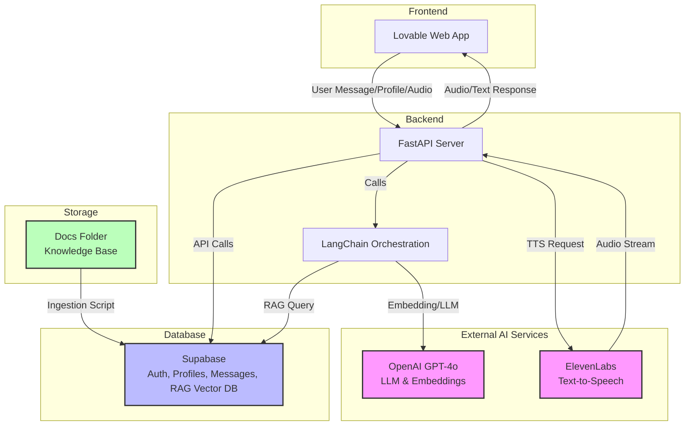

# Sports Psychologist AI Agent MVP: Architecture Diagram

---

**Legend:**
- **Lovable Web App:** User interface for chat, profile, and audio.
- **FastAPI Server:** Handles API endpoints, user logic, and orchestration.
- **LangChain:** Manages prompt construction, RAG, and LLM calls.
- **Supabase:** Stores user auth, profiles, messages, and RAG vectors.
- **OpenAI:** Provides LLM (GPT-4o) and embeddings for RAG.
- **ElevenLabs:** Provides TTS audio for agent responses.
- **Docs Folder:** Local knowledge base, ingested into Supabase for RAG.

**Flow:**
1. User interacts via Lovable (chat, profile, audio).
2. FastAPI handles requests, fetches/saves data in Supabase, and orchestrates LangChain.
3. LangChain retrieves relevant docs (RAG) and calls OpenAI for LLM/embeddings.
4. FastAPI calls ElevenLabs for TTS as needed.
5. All knowledge base docs are ingested into Supabase for RAG. 